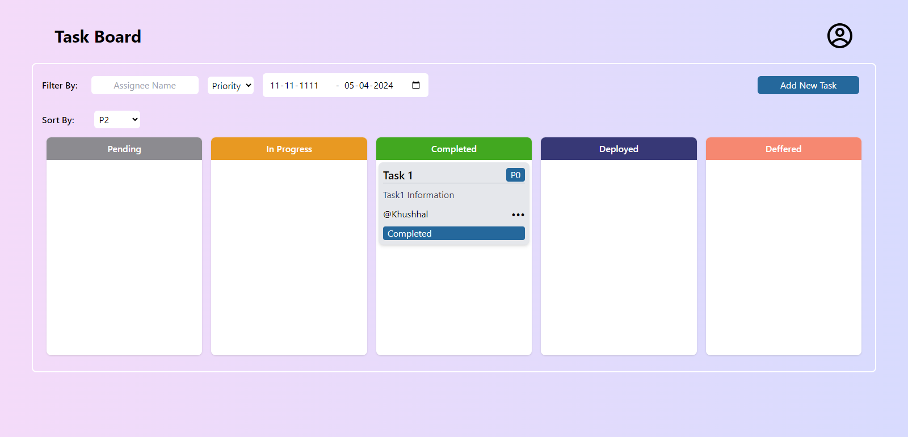

# Task Manager Project

## Overview

This project is a task manager application that allows users to create, manage, and track tasks efficiently. It provides features such as adding tasks, editing tasks, marking tasks as completed, filtering tasks, and sorting tasks based on various parameters.

## Live Link
[Live Link](https://www.example.com)

## UI

## Technologies Used

- **Frontend**:
  - React.js: A JavaScript library for building user interfaces.
  - Tailwind CSS: A utility-first CSS framework for rapidly building custom designs.
  - Recoil: A state management library for managing React state.
  - React Icons: A library of popular icons for React applications.

## Features

- **Task Management**: Users can create, edit, and delete tasks.
- **Filtering**: Users can filter tasks based on assignee, priority, status, and deadline.
- **Sorting**: Users can sort tasks based on priority.
- **Responsive Design**: The application is responsive and works well on various screen sizes.
- **User-friendly Interface**: The interface is intuitive and easy to use, providing a seamless experience for users.

## Setup Instructions

1. Clone the repository: `git clone https://github.com/khushhalgarg112/Task-Manager.git`
2. Navigate to the project directory: `cd task-manager`
3. Install dependencies: `npm install`
4. Start the development server: `npm run dev`
5. Open the application in your browser: `http://localhost:3000`

## Usage

- **Creating a Task**: Click on the "Add New Task" button and fill in the task details.
- **Editing a Task**: Click on the edit button on the task card and update the task details.
- **Deleting a Task**: Click on the delete button on the task card to delete the task.
- **Filtering Tasks**: Use the filter options to filter tasks based on assignee, priority, status, and deadline.
- **Sorting Tasks**: Use the sorting option to sort tasks based on priority.

## Contributing

Contributions are welcome! If you'd like to contribute to this project, please follow these steps:

1. Fork the repository.
2. Create a new branch: `git checkout -b feature-new-feature`
3. Make your changes and commit them: `git commit -am 'Add new feature'`
4. Push to the branch: `git push origin feature-new-feature`
5. Submit a pull request.

## License

[Choose an appropriate license for your project and mention it here. For example: MIT License, Apache License, etc.]

